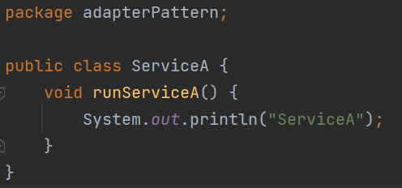

# AdapterPattern

어댑터를 생각해보면 흔히 사용하는 휴대폰 충전기의 어댑터를 생각해 볼 수 있다.

어댑터는 220V라는 콘센트에 서로 다른 종류의 충전기가 휴대폰과 전원 콘센트 사이에서 둘을 연결해주는 변환기의 역할을 수행해 준다.

데이터 베이스에서 다양한 데이터베이스 시스템을 공통의 인터페이스인 ODBC 또는 JDBC를 이용해서 조작할 수 있는데, ODBC/JDBC 가 어댑터 패턴을 사용해서 다양한 데이터베이스 시스템을 단일한 인터페이스로 조작할 수 있게 해주기 때문이다.

# **어댑터 패턴이 적용되지 않은 코드**

`ClientWithNoAdapter` 클래스에서 main() 메서드를 보면 sa1 참조 변수와 sb1 참조 변수를 통해 호출하는 각 메서드가 비슷한 일을 하지만 메서드명이 다르다.(sa1은 `runServiceA()` 메소드 호출, sb1는 `runServiceB()` 메소드 호출)

# **어댑터 패턴이 적용된 코드**

어댑터 패턴을 적용해서 위의 main 메소드에서 다른 메소드의 이름을 통일 할 수 있다.

기존의 ServiceA와 ServiceB의 메서드를 runService()라고 하는 같은 이름의 메서드를 호출할 수 있게 해주는 변환기이다.

AdapterService에서는 변환하고자 하는 클래스를 생성해서 같은 이름의 메소드를 통해서 호출 할 수 있게 바꿔 줄 수있다.

기존에 main에서 `runServiceA()` 와 `runServiceB()` 로 나누어서 호출하는것이 어댑터패턴을 통해 main에서 `runService()` 라는 동일한 메서드를 호출 할 수 있게 한다.

동일한 메소드 이름을 호출하므로 이를 인터페이스화 해서 해당 메서드의 이름을 규정할 수 있다.

어댑터 패턴은 합성, 즉 객체를 속성으로 만들어서 참조하는 디자인 패턴으로, 한 문장으로 정리하면 다음과 같다.

**“호출당하는 쪽의 메서드를 호출하는 쪽의 코드에 대응하도록 중간에 변환기를 통해 호출하는 패턴”**