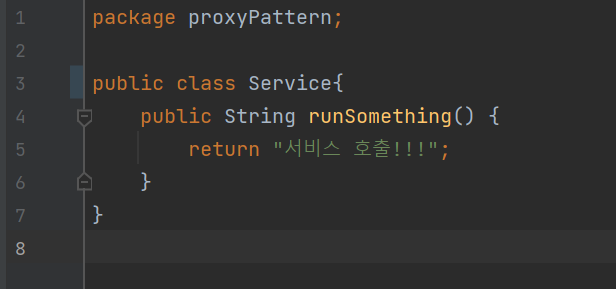

# 프록시패턴 (Proxy Pattern)

프록시(proxy)는 대리자, 대변인이라는 뜻을 가진 단어이다.

대리자/대변인이라고 하면 다른 누군가를 대신해 그 역할을 수행하는 존재를 말한다. 뉴스에는 항상 청와대 대변인, 백악관 대변인 등등 다양한 대변인이 등장한다.

디자인 패턴에서도 이렇게 대리자/대변인이 등장합니다.

우선 대리자를 사용하지 않고 직접 호출하는 코드를 보면

Service라는 클래스를 호출하는 ClientWithNoProxy라는 클래스는 대변인의 존재를 사용하지않은 즉, 프록시 패턴을 적용하지 않은 클래스이다.

Service클래스에서 직접적으로 runSomething 메소드를 호출해서 ***서비스 호출!!!*** 이라는 결과를 보여준다.

그럼 프록시 패턴이 적용된 경우를 보면, 프록시 패턴의 경우 실제 서비스 객체가 가진 메서드와 같은 이름의 메서드를 사용하는데, 이를 위해 *인터페이스*를 사용한다.

인터페이스를 사용하면 서비스 객체가 들어갈 자리에 대리자 객체를 대신 투입해 클라이언트쪽에서는 ***실제 서비스 객체를 통해 메서드를 호출하고 반환값을 받는지, 대리자 객체를 통해 메서드를 호출하고 반환값을 받는지 전혀 모르게 처리 할 수도 있다.***

### IService라는 이름의 인터페이스를 작성해서 호출하고자 하는 메소드를 정의합니다.

### IService를 구현하는 구현체로써 Service클래스를 작성해서 runSomething에 대한 내용을 작성합니다.

### 그리고나서 대리자로써 역할을 수행할 Proxy 객체를 만들어서 똑같이 IService의 구현체로써 생성을 합니다.

### 그럼 프록시를 사용한 객체에서의 호출을 사용하면 중간에 대리자 객체(Proxy)를 거치고 난 후에 실제 구현 객체(Service)에 대한 메소드를 수행 할 수 있게 됩니다.

흐름을 보면

ClientWithProxy ⇒ IService(Proxy) ⇒ IService(Service)

IService에 정의된 runsomething 메소드를 호출하였는데 중간에 똑같은 구현체인 Proxy 클래스의 runSomething을 통해서 중간의 Proxy 클래스에서 runSomething에 대한 내용을 가로채서 `"호출에 대한 흐름 제어가 주목적, 반환 결과를 그대로 전달"` 이라는 문구가 나온 뒤에 실제 Service에서 `"서비스 호출!!!"` 을 출력하는 것을 볼 수 있다.

프록시 패턴의 중요 포인트를 짚어 보면

- 대리자는 실제 서비스와 같은 이름의 메서드를 구현한다. 이때 인터페이스를 사용한다.
- 대리자는 실제 서비스에 대한 참조 변수를 갖는다(합성).
- 대리자는 실제 서비스의 같은 이름을 가진 메서드를 호출하고 그 값을 클라이언트에게 돌려준다.
- 대리자는 실제 서비스의 메서드 호출 전후에 별도의 로직을 수행할 수도 있다.

프록시 패턴은 실제 서비스 메서드의 반환값에 가감하는 것을 목적으로 하지 않고 제어의 흐름을 변경하거나 다른 로직을 수행하기 해 사용한다.

프록시 패턴을 한 문장으로 정리하면

### ***“제어 흐름을 조정하기 위한 목적으로 중간에 대리자를 두는 패턴”***

프록시 패턴은 SOLID에서 개방 패쇄 원칙(OCP)과 의존 역전 원칙(DIP)이 적용된 설계 패턴이기도 하다.