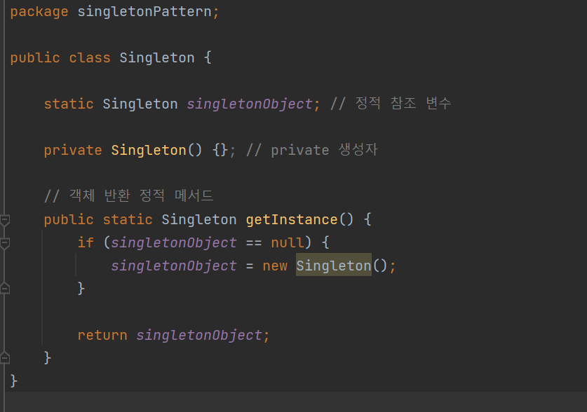

# 싱글턴 패턴(Singleton Pattern)

싱글턴 패턴이란 인스턴스를 하나만 만들어 사용하기 위한 패턴이다.

커넥션 풀, 스레드 풀, 디바이스 설정 객체 등과 같은 경우 인스턴스를 여러 개 만들게 되면 불필요한 자원을 사용하게 되고, 프로그램이 예상치 못한 결과를 낳을 수 있다.

싱글턴 패턴은 오직 인스턴스를 하나만 만들고 그것을 계속해서 재사용한다.

싱글턴 패턴을 적용할 경우 의미상 두 개의 객체가 존재할 수 없다. 이를 구현하려면 객체 생성을 위한 new에 제약을 걸어야 하고, 만들어진 단일 객체를 반환할 수 있는 메서드가 필요하다.

따라서 필요한 요소들이 3가지가 필요하다.

- new를 실행할 수 없도록 생성자에 private 접근 제어자를 지정한다.
- 유일한 단일 객체를 반환할 수 있는 정적 메서드가 필요하다.
- 유일한 단일 객체를 참조할 정적 참조 변수가 필요하다.



`static Singleton *singletonObject*; // 정적 참조 변수`

단일 객체를 저장하기 위한 정적 참조 변수를 선언해준다.

`private Singleton() {}; // private 생성자`

new를 통해 객체를 생성할 수 없도록 생성자에 private을 지정했다.

```java
// 객체 반환 정적 메서드
public static Singleton getInstance() {
    if (singletonObject== null) {
singletonObject= new Singleton();
    }

    returnsingletonObject;
}
```

단일 객체를 반환하기 위한  getInstance() 정적 메서드를 생성해준다.

getInstance() 정적 메서드를 보면 정적 참조 변수에 객체가 할당돼 있지 않은 경우에만 new를 통해 객체를 만들고 정적 참조 변수에 할당한다.

그리고 정적 참조 변수에 할당돼 있는 유일한 객체의 참조를 반환한다.


6번째 줄의 주석을 풀면 바로 에러가 나는 것을 확인 할 수 있다. private 생성자이기 때문에 Singleton외부에서 new를 이용해 객체를 생성할 수 없기 때문이다. 주석을 풀었을때 에러메시지는 다음과 같다.


4개의 참조 변수(singletonObject, s1, s2, s3)가 하나의 단일 객체를 참조하는 것을 볼 수 있다.

이것이 싱글턴 패턴의 핵심이다. 단일 객체인 경우 결국 공유 객체로 사용되기 때문에 속성을 갖지 않는게 정석이다. 단일 객체가 속성을 갖게 되면 하나의 참조 변수가 변경한 단일 객체의 속성이 다른 참조 변수에 영향을 미치기 때문이다. 이는 전역/공유 변수를 가능한 한 사용하지말라는 지침과 일맥상통한다.

다만 읽기 전용 속성을 갖는 것은 문제가 되지 않는다. 이와 더불어 단일 객체가 다른 단일 객체에 대한 참조를 속성으로 가진 것 또한 문제가 되지 않는다.

실행결과


객체의 고유값인 hashcode를 반환하여 출력하는데 이 값이 3개의 객체 모두 같은 객체를 참조하기 때문에 같은 값이 나온다.

싱글턴 패턴의 특징

- private 생성자를 갖는다.
- 단일 객체 참조 변수를 정적 속성으로 갖는다.
- 단일 객체 참조 변수가 참조하는 단일 객체를 반환하는 getInstance() 정적 메서드를 갖는다.
- 단일 객체는 쓰기 가능한 속성을 갖지 않는 것이 정석이다.

한문장 정리

***“클래스의 인스턴스, 즉 객체를 하나만 만들어 사용하는 패턴”***