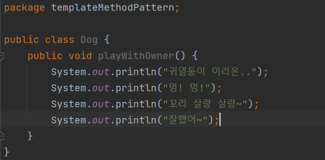

# 템플릿 메서드 패턴

볼트라고 하는 이름의 강아징와 키티라는 이름의 고양이를 키운다고 상상해보자.

볼트, 키티와 함께 재미있는 시간을 보내는 세계를 프로그래밍으로 표현한다면 다음과 같은 2개의 클래스가 필요 할 것입니다.

Dog클래스와 Cat 클래스 안에 있는 playWithOwner() 메서드를 보면 서로 짖는 부분(멍멍, 야옹야옹)만 빼고는 모두 동일한 것을 볼 수 있다.

코드를 보고 있으면 객체 지향의 4대 특성 가운데 상속을 통해 동일한 부분(중복)은 상위 클래스로, 달라지는 부분만 하위 클래스로 분할하고 싶은 객체 지향 설계에 대한 욕구가 자극될 것입니다.

따라서 이 코드를 개선해보겠습니다.

상위 클래스인 Animal에는 템플릿(견본)을 제공하는 playWithOwner() 메서드와 하위 클래스에게 구현을 강제하는 play() 추상 메서드, 하위 클래스가 선택적으로 오버라이딩 할 수 있는 runSomething() 메서드가 있다. 하위 클래스인 Dog과 Cat은 상위 클래스인 Animal에서 구현을 강제하고 있는 play() 추상 메서드를 반드시 구현해야 한다.

runSomething() 메서드는 선택적으로 오버라이딩 할 수 있다. 이처럼 상위 클래스에 공통 로직을 수행하는 템플릿 메서드와 하위 클래스에 오버라이딩을 강제하는 추상 메서드 또는 선택적으로 오버라이딩 할 수 있는 훅(Hook)  메서드를 두는 패턴을 템플릿 메서드 패턴이라고 한다.

템플릿 메서드 패턴을 한 문장으로 정리하면

***“상위 클래스의 견본 메서드를 하위 클래스가 오버라이딩한 메서드를 호출하는 패턴이다.”***